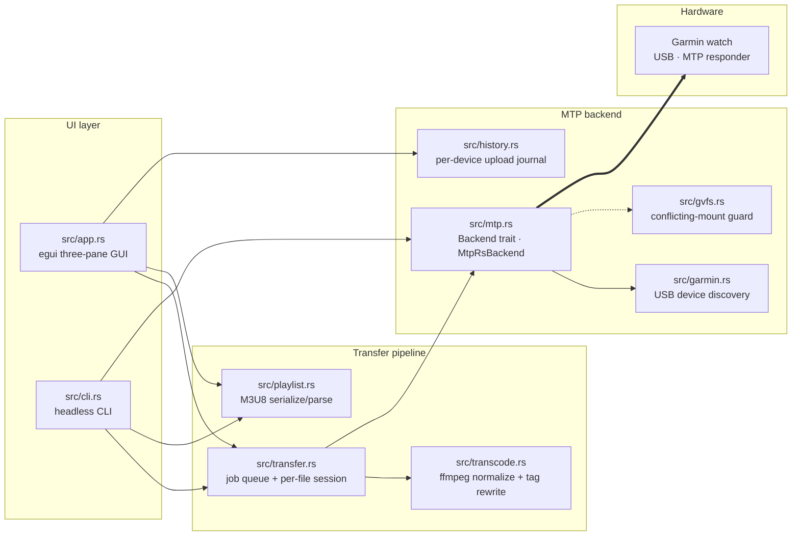

<h1 align="center">Krypteia · Pelican</h1>

<p align="center">
  <strong>Sync your music to a Garmin watch on Linux. Without renting it from anyone.</strong>
</p>

<p align="center">
  <a href="https://github.com/n0ble-s1x/pelican"></a>
  <a href="https://github.com/n0ble-s1x/pelican/releases"></a>
  
  
  <a href="LICENSE-MIT"></a>
  
</p>

A small Rust tool — single static binary, no webview, no daemon, no telemetry — that drops music files onto a Garmin watch over USB/MTP. It exists because Garmin Express is Windows/Mac only, the Linux MTP stack is fragile, and we shouldn't have to choose between owning our media and using the platform we want.

A [Krypteia](https://github.com/n0ble-s1x) project.

---

## Why this exists

Krypteia is a privacy and security consulting practice. Our mission is to help people take back their digital sovereignty — to understand the systems they live inside, and to choose tools that don't make them the product.

This tool is part of that. We believe:

- **Privacy is a prerequisite for freedom.** What you listen to, when, and where — that's nobody's business but yours.
- **Own your data. Own your media.** Buy it once, keep it forever, no subscription tax, no licensing terms that change under you.
- **Open source is a public good.** Useful software should be inspectable, forkable, and improvable by anyone. We give back.
- **Linux deserves first-class tools.** Big Tech's desktop strategy treats Linux as "too small to bother with." We disagree.

If you're tired of streaming services telling you what you can listen to and watching them pull tracks out of "your" library — there's a way out. Buy your music DRM-free ([Qobuz](https://www.qobuz.com/) for hi-res FLAC, [Bandcamp](https://bandcamp.com/) for direct artist support, [7digital](https://www.7digital.com/) for catalogue) and put it on devices that play files, not licenses.

---

## Why a Garmin

We like Garmin watches because **you don't have to give them a phone.** Most modern fitness watches are useless without pairing to a smartphone running a vendor app that ingests your activity data, your heart rate, your sleep, your location — and uploads it to a cloud you don't control. Garmin watches still work standalone. Buy one, never sign into Garmin Connect, never install the phone app, and the watch still tracks your runs, paces you, and plays the music you put on it.

Combined with Pelican — which puts music on the watch over a USB cable, no account required — you have a complete loop: fitness data stays on the watch, your music stays on your computer, neither leaves unless you decide.

The **Tactix** and high-end **Forerunner** lines are excellent. The **Instinct** line is great if you want a rugged minimalist watch — though note that as of this writing **Instinct models don't have on-watch music**, so this tool won't help you there. Check the spec page before buying for music sync.

For the record: we're not affiliated with Garmin.

---

## Features

### Music handling

- Direct upload of **MP3, M4A, M4B, AAC, WAV** — Garmin's native formats
- Auto-transcode of **FLAC, OGG, Opus, WMA, AIFF, ALAC, APE, WV** → CBR 192 kbps MP3 via `ffmpeg`
- Strict **ID3v2.3 tag rewrite** — only `title / artist / album / track / date / genre` (Garmin's indexer silently rejects non-standard frames)
- **Album-artist normalization** — multi-composer albums (soundtracks, classical) group as one album in the watch's library
- **Filename sanitization** — 56-char cap and FAT-hostile-character stripping (Garmin firmware silently drops longer/exotic names)
- **Streaming uploads** — chunks read lazily from disk; no full-file buffer

### Watch interaction

- **Three-pane GUI** (egui/eframe) — LOCAL · ACTIONS · WATCH, drag-drop both intra-app and from your file manager
- Headless **CLI** for scripting and CI
- **Per-handle delete** including broken stubs from prior failed uploads
- **GVFS-mount detection** — refuses to start if another MTP backend is holding the device
- **Per-device upload journal** in `$XDG_DATA_HOME/pelican/`

### Privacy

- **Zero telemetry.** Pelican phones home to nothing.
- **No internet access required** — everything runs locally.
- **No daemon, no background service.** Runs only when you run it.
- **Reproducible builds** via checked-in `Cargo.lock`.
- **Dependency surface kept narrow** and audited.

---

## Compatibility

| Model                    | Firmware | Status                                                           |
|--------------------------|----------|------------------------------------------------------------------|
| Forerunner 165 Music     | 2506     | ✅ Music sync verified end-to-end. Playlist write rejected (see [docs/playlists.md](docs/playlists.md)) |
| Forerunner 245 / 255 Music | —      | 🟡 Untested but presumed working (same MTP responder family)     |
| Forerunner 645 Music     | —        | 🟡 Untested. `better-sync` reports working                       |
| Forerunner 945 / 955 / 965 Music | — | 🟡 Untested. `better-sync` reports working                       |
| Forerunner 265           | —        | 🟡 Untested                                                      |
| Venu 2 / 3               | —        | 🟡 Untested. `better-sync` reports working                       |
| Fenix 5 Plus / 6 / 7 / 8 (music variants) | — | 🟡 Untested                                          |
| Epix Gen 2               | —        | 🟡 Untested                                                      |
| Tactix Delta / 7         | —        | 🟡 Untested                                                      |
| Instinct (any)           | —        | ❌ Not applicable — no on-watch music                            |

**Want a model added to the verified row?** We'll happily make it work — but we need hardware. Send a PR with model-specific quirks if you find any, or [open an issue](https://github.com/n0ble-s1x/pelican/issues) if you can lend a unit for testing.

---

## Install

### From source (any distro)

```sh
# Prerequisites: Rust 1.85+, ffmpeg, libudev
git clone https://github.com/n0ble-s1x/pelican
cd pelican
cargo build --release

# Install the udev rule so you don't need root to talk to the watch
sudo install -m 644 udev/99-garmin-music.rules /etc/udev/rules.d/
sudo udevadm control --reload && sudo udevadm trigger
```

### Debian / Ubuntu / Pop!_OS (`.deb`)

```sh
cargo install cargo-deb
cargo deb --release
sudo apt install ./target/debian/pelican_*.deb
```

### Arch Linux (AUR)

A `PKGBUILD` is shipped at [`packaging/aur/PKGBUILD`](packaging/aur/PKGBUILD); AUR submission is planned for the first tagged release.

### Flatpak

A manifest is at [`packaging/flatpak/com.krypteia.Pelican.yaml`](packaging/flatpak/) for distribution-agnostic builds; Flathub submission is planned for v0.2.

---

## Use

Plug your watch in. Put it in MTP USB mode. Run:

```sh
pelican
```

Drag a folder of music onto the **WATCH** pane. Watch the green dots. Done.

### Headless / CLI

```sh
# Upload an album (transcodes anything Garmin doesn't natively play)
pelican --copy ~/Music/Album

# Upload without transcoding (sources must already be MP3/M4A/AAC/WAV)
pelican --no-transcode --copy ~/Music/already-mp3

# Refuse to upload files missing ID3 title+artist (default: warn + upload)
pelican --require-tags --copy ~/Music/Album

# Delete files by remote path
pelican --delete "Music/foo.mp3" --delete "Music/bar.mp3"

# List existing playlists in /Music
pelican --list-playlists

# Pick a specific watch when multiple are attached
pelican --serial 0000d221c983 --copy ~/Music/Album
```

---

## Tech stack

| Layer                 | Technology                                          |
|-----------------------|-----------------------------------------------------|
| Language              | Rust 2021 edition (MSRV 1.85)                       |
| GUI shell             | [eframe](https://crates.io/crates/eframe) + [egui](https://crates.io/crates/egui) 0.34 (glow + Wayland + X11) |
| MTP transport         | [`mtp-rs`](https://crates.io/crates/mtp-rs) 0.13 over [`nusb`](https://crates.io/crates/nusb) 0.2 (pure Rust, no libusb) |
| Audio decode/inspect  | [`id3`](https://crates.io/crates/id3) 1.14, [`mp4ameta`](https://crates.io/crates/mp4ameta) 0.13 |
| Audio normalization   | `ffmpeg` shell-out (system dep) — libmp3lame, ID3v2.3 |
| CLI                   | [`clap`](https://crates.io/crates/clap) 4.5 derive  |
| Async runtime         | [`tokio`](https://crates.io/crates/tokio) 1 (current-thread, used only for MTP transport) |
| Logging               | [`tracing`](https://crates.io/crates/tracing) + env-filter subscriber |
| Persistence           | `serde_json` (per-device upload journal)            |
| Build outputs         | static-ish binary, single-file install              |

`unsafe` is denied at the crate level (`#![deny(unsafe_code)]`); the only carve-out is a documented `geteuid()` POSIX wrapper in `src/gvfs.rs`.

---

## Architecture



---

## Documentation

The [`docs/`](docs/) directory is the working notebook for protocol findings and audit trails.

| Doc                                                  | Contents                                                                  |
|------------------------------------------------------|---------------------------------------------------------------------------|
| [`docs/status.md`](docs/status.md)                   | What works, what doesn't, what's blocked. **Start here.**                 |
| [`docs/garmin-mtp.md`](docs/garmin-mtp.md)           | Protocol reference — IDs, format codes, folder layout, firmware quirks    |
| [`docs/playlists.md`](docs/playlists.md)             | Playlist sync recipe + 2026-05-03 FR165 probe results                     |
| [`docs/vendor-ops.md`](docs/vendor-ops.md)           | Garmin vendor MTP opcodes (`0x9000-0x900B`, `0x9810`, `0x9811`)           |
| [`docs/testing.md`](docs/testing.md)                 | Probe examples, recovery from a wedged USB session                        |
| [`docs/audit-2026-05-03.md`](docs/audit-2026-05-03.md) | Code audit — fixes shipped, follow-ups                                  |
| [`docs/research-log.md`](docs/research-log.md)       | Dated entries — links followed, references compared                       |
| [`docs/references/`](docs/references/)               | Snapshots of external code/threads we relied on                           |

---

## Known limits / open questions

- **MTP playlist write fails on Forerunner 165 Music** (FW 2506). All six tried variants — three path styles × two format codes plus an `#EXTINF` variant — were silently rejected. Older Garmin music watches (FR945, FR255, Venu, FR645) are reported working by upstream `better-sync`. Resolving this needs either a wire-level capture of Garmin Express writing a playlist, or a borrowed older watch to confirm the FR165 firmware delta. See [`docs/playlists.md`](docs/playlists.md). **Help wanted.**
- **Filename collisions corrupt both files** on the watch when two source files sanitize to the same `remote_name`. Pelican should detect collisions before `SendObjectInfo`; not yet implemented (see [`docs/audit-2026-05-03.md`](docs/audit-2026-05-03.md) finding #4).
- **Subfolders inside `/Music`** are unreliable on the watch firmware — newly-created subfolders return `Protocol GeneralError` when listed. Pelican flattens by default; `--no-flatten` is opt-in.
- **macOS** support is possible but not planned. PRs welcome.
- **Windows** is out of scope — use Garmin Express.

---

## Privacy / security

- Zero telemetry, zero network access at runtime.
- Per-device journal lives at `~/.local/share/pelican/uploads-<serial>.json`. Nothing leaves the machine.
- Dependency surface kept narrow and audited.
- Vulnerability reports → [`SECURITY.md`](SECURITY.md).

---

## Contributing

Read [`CONTRIBUTING.md`](CONTRIBUTING.md). PRs welcome. Code review happens before merge — for security and quality, not gatekeeping. New device support, packaging help, and the playlist-protocol reverse-engineering listed above are all wanted.

---

## License

Dual-licensed under [MIT](LICENSE-MIT) and [Apache 2.0](LICENSE-APACHE) at your option.

---

## Acknowledgements

- [`mtp-rs`](https://crates.io/crates/mtp-rs) and [`nusb`](https://crates.io/crates/nusb) — pure-Rust MTP/USB stack we stand on.
- [`better-sync`](https://github.com/Schachte/better-sync) (Schachte) — Go reference implementation that informed our playlist-format research.
- [`go-mtpfs`](https://github.com/ganeshrvel/go-mtpfs) — the upstream PR documenting Garmin's split-header / short-data-phase USB quirks.
- [`libmtp`](https://github.com/libmtp/libmtp) — device-table research and `DEVICE_FLAGS_ANDROID_BUGS` lineage that explained the firmware family.
- Pattern inspiration from [Pop!_OS COSMIC Files](https://github.com/pop-os/cosmic-files) (GPL-3.0 — pattern only, no code borrowed).
- Everyone who keeps fighting for the open web. Keep going.

— *Krypteia, 2026*
