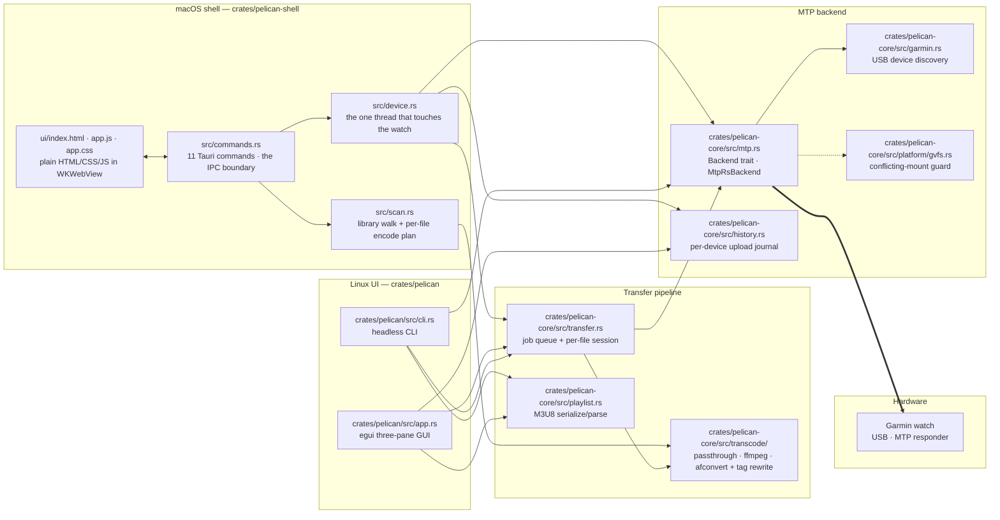

<h1 align="center">Krypteia · Pelican</h1>

<p align="center">
  <strong>Your music on your Garmin watch. No account, no cloud, no vendor app.</strong>
</p>

<p align="center">
  <a href="https://github.com/n0ble-s1x/pelican"></a>
  <a href="https://github.com/n0ble-s1x/pelican/releases"></a>
  
  
  <a href="LICENSE-MIT"></a>
  
</p>

A small Rust tool that browses your music, plays it, and puts a chosen set onto a Garmin watch over USB/MTP. **No daemon, no telemetry, and no network access at runtime** — on either platform.

It exists because every path Garmin offers runs through a Garmin account. Garmin Express is Windows and macOS only, and it wants you signed in; on Linux there is no vendor tool at all and the MTP stack is fragile. Owning your music should not mean renting the cable.

Two builds, and they are not the same shape:

| | macOS | Linux |
|---|---|---|
| Binary | `pelican-shell` — a Tauri 2 binary you run from the build tree | `pelican` — a single static binary |
| Interface | `ui/` (plain HTML/CSS/JS) in the system **WKWebView**, plus in-app playback | egui three-pane GUI, no webview |
| Setup | none — see [Install](#install) | one udev rule |

The webview is a real part of the macOS attack surface and is documented as such in [SECURITY.md § The macOS shell](SECURITY.md#the-macos-shell-cratespelican-shell). "Single static binary, no webview" describes the Linux build only.

A [Krypteia](https://github.com/n0ble-s1x) project.

---

## Why this exists

Krypteia is a privacy and security consulting practice. Our mission is to help people take back their digital sovereignty — to understand the systems they live inside, and to choose tools that don't make them the product.

This tool is part of that. We believe:

- **Privacy is a prerequisite for freedom.** What you listen to, when, and where — that's nobody's business but yours.
- **Own your data. Own your media.** Buy it once, keep it forever, no subscription tax, no licensing terms that change under you.
- **Open source is a public good.** Useful software should be inspectable, forkable, and improvable by anyone. We give back.
- **Linux deserves first-class tools.** Big Tech's desktop strategy treats Linux as "too small to bother with." We disagree.

If you're tired of streaming services telling you what you can listen to and watching them pull tracks out of "your" library — there's a way out. Buy your music DRM-free ([Qobuz](https://www.qobuz.com/) for hi-res FLAC, [Bandcamp](https://bandcamp.com/) for direct artist support, [7digital](https://www.7digital.com/) for catalogue) and put it on devices that play files, not licenses.

---

## Why a Garmin

We like Garmin watches because **you don't have to give them a phone.** Most modern fitness watches are useless without pairing to a smartphone running a vendor app that ingests your activity data, your heart rate, your sleep, your location — and uploads it to a cloud you don't control. Garmin watches still work standalone. Buy one, never sign into Garmin Connect, never install the phone app, and the watch still tracks your runs, paces you, and plays the music you put on it.

Combined with Pelican — which puts music on the watch over a USB cable, no account required — you have a complete loop: fitness data stays on the watch, your music stays on your computer, neither leaves unless you decide.

The **Tactix** and high-end **Forerunner** lines are excellent. The **Instinct** line is great if you want a rugged minimalist watch — though note that as of this writing **Instinct models don't have on-watch music**, so this tool won't help you there. Check the spec page before buying for music sync.

For the record: we're not affiliated with Garmin.

---

## Features

### Listening

The watch holds about 3.7 GB. Committing a track is a real decision, and
choosing blind is what makes the alternatives tedious — so on macOS Pelican is
a local player first and a sync tool second.

- **Browse a library** on local disk or a NAS, and **audition tracks** before
  committing them to the watch
- **Albums and artists** views, and a playback queue
- **Media keys** and Control Center transport
- **Cover art** read out of your own file at play time — nothing is fetched
- The watch wall **says where its grouping came from**: Pelican's own upload
  journal, not a claim about the device's library

Playback is the system webview decoding your file — MP3, AAC, ALAC, FLAC and
WAV natively. macOS build only; the Linux egui build does not play.

### Music handling

Three encode paths, picked per file. Which one runs depends on the source
format and what is installed:

| Source | Path | Needs |
|---|---|---|
| MP3, M4A, M4B, AAC, WAV | **Passthrough** — copied byte-for-byte, tag rebuilt in process | nothing |
| FLAC, ALAC, AIFF | **ffmpeg** → CBR 192 kbps MP3 when it is installed, otherwise **afconvert** → CBR 192 kbps AAC in M4A on macOS | nothing on macOS |
| OGG, Opus, WMA, APE, WV | **ffmpeg** → CBR 192 kbps MP3 | `ffmpeg` on either platform |

`encoder::plan` takes the first encoder present that can decode the source, and
ffmpeg is first in that order — so ffmpeg wins wherever both exist, and
afconvert is what a Mac with nothing installed falls back to. Row two is the
only row with a fallback; row three has no macOS-native decoder at all.

`ffmpeg` is **not** an unconditional requirement of the application. It is
required for the third row on either platform, and for every non-passthrough
row on Linux, which has no afconvert. The afconvert path is confirmed end to
end: on 2026-09-05 an afconvert-produced M4A uploaded, indexed **and played**
on a Forerunner 165 Music running firmware 2506. Upload, indexing and playback
are three separate subsystems and all three now have an observation behind
them. That is one device on one firmware — see
[`docs/macos-port.md`](docs/macos-port.md) for the scope, and note that Linux
has no afconvert and so still needs ffmpeg for this row.

- Strict **ID3v2.3 tag rewrite** — only `title / artist / album / track / date / genre` (Garmin's indexer silently rejects non-standard frames)
- **Album-artist normalization** — multi-composer albums (soundtracks, classical) group as one album in the watch's library
- **Filename sanitization** — 56-char cap and FAT-hostile-character stripping (Garmin firmware silently drops longer/exotic names)
- **Streaming uploads** — chunks read lazily from disk; no full-file buffer

### Watch interaction

- **CLI only, for now** — `pelican push / status / ls / ledger`. The UI is being rebuilt against the new core
- **Never removes anything from the watch.** A track that reaches the watch's music library stays there until a factory reset, whatever any tool does (see [`docs/garmin-library-persistence.md`](docs/garmin-library-persistence.md)); Pelican has no command that pretends otherwise
- **Proof by read-back** — every upload is downloaded again and its SHA-256 compared with the file that was sent
- **Collision guard** — Pelican checks every name the watch can report before it writes, at plan time and again in the open session immediately before the upload. MTP has no overwrite, and a same-name write destroys *both* copies (see [`docs/garmin-mtp.md`](docs/garmin-mtp.md) §7)
- **GVFS-mount detection** on Linux — warns if a GVFS MTP mount is holding the device, and names the `gio mount -u` fix
- **Per-device upload journal** — `$XDG_DATA_HOME/pelican/` on Linux, `~/Library/Application Support/com.krypteia.pelican/` on macOS

### Privacy

- **Zero telemetry.** Pelican phones home to nothing.
- **No internet access required** — everything runs locally.
- **No daemon, no background service.** Runs only when you run it.
- **Reproducible builds** via checked-in `Cargo.lock`.
- **Dependency surface kept narrow** and audited.

---

## Compatibility

| Model                    | Firmware | Status                                                           |
|--------------------------|----------|------------------------------------------------------------------|
| Forerunner 165 Music     | 2506     | ✅ Music sync verified end-to-end. Playlist write rejected (see [docs/playlists.md](docs/playlists.md)) |
| Forerunner 245 / 255 Music | —      | 🟡 Untested but presumed working (same MTP responder family)     |
| Forerunner 645 Music     | —        | 🟡 Untested. `better-sync` reports working                       |
| Forerunner 945 / 955 / 965 Music | — | 🟡 Untested. `better-sync` reports working                       |
| Forerunner 265           | —        | 🟡 Untested                                                      |
| Venu 2 / 3               | —        | 🟡 Untested. `better-sync` reports working                       |
| Fenix 5 Plus / 6 / 7 / 8 (music variants) | — | 🟡 Untested                                          |
| Epix Gen 2               | —        | 🟡 Untested                                                      |
| Tactix Delta / 7         | —        | 🟡 Untested                                                      |
| Instinct (any)           | —        | ❌ Not applicable — no on-watch music                            |

**Want a model added to the verified row?** We'll happily make it work — but we need hardware. Send a PR with model-specific quirks if you find any, or [open an issue](https://github.com/n0ble-s1x/pelican/issues) if you can lend a unit for testing.

---

## Install

**macOS is built from source today.** There is no signed `.dmg`, no notarized
bundle and no universal binary, and this file will not claim one until there
is — `packaging/` holds an AUR `PKGBUILD` and a Flatpak manifest, the Debian
package is configured in `[package.metadata.deb]` in
`crates/pelican/Cargo.toml`, and there is nothing for macOS.

There is not even an `.app`. `crates/pelican-shell/tauri.conf.json` sets
`bundle.targets` to `["app", "dmg"]`, but `cargo tauri build` (tauri-cli
2.11.4, macOS 26.6.2) stops at `Failed to create app icon: No matching
IconType`: the macOS bundler wants an `.icns` and `icons/` holds a single
1024px PNG. What you get from the command below is
`target/release/pelican-shell`, a plain Mach-O binary you run from the build
tree.

The workspace has three crates and no `default-members`, so a bare
`cargo build --release` at the root builds *both* front ends — which on Linux
drags in the whole Tauri/webkit2gtk chain. Always name the package you want.

### macOS (from source)

```sh
# Prerequisites: Rust 1.85+ and the Xcode command-line tools.
# No ffmpeg unless your library has OGG/Opus/WMA/APE/WV in it.
# No udev equivalent, no sudo step, no SIP change: the watch presents
# bDeviceClass = 0, so Apple's ptpcamerad never claims it.
git clone https://github.com/n0ble-s1x/pelican
cd pelican
cargo build --release -p pelican-shell
```

Verified on macOS 26.6.2 (Apple silicon) against a Forerunner 165 Music on
firmware 2506. A binary you build yourself runs unsigned without complaint,
because Gatekeeper only quarantines what arrives from elsewhere — which is
also why there is nothing to distribute: notarization needs a paid Apple
Developer Program membership we do not have. See
[`docs/macos-port.md`](docs/macos-port.md).

### Linux (from source)

```sh
# Prerequisites: Rust 1.85+, libudev.
# ffmpeg only if your library has formats the passthrough path can't take.
git clone https://github.com/n0ble-s1x/pelican
cd pelican
cargo build --release -p pelican

# Install the udev rule so you don't need root to talk to the watch
sudo install -m 644 udev/70-garmin-mtp.rules /etc/udev/rules.d/
sudo udevadm control --reload && sudo udevadm trigger
```

Building `pelican-shell` on Linux additionally needs `webkit2gtk-4.1` and
`libsoup3` development packages. The Linux binary is `pelican` and does not.

### Debian / Ubuntu / Pop!_OS (`.deb`)

```sh
cargo install cargo-deb
cargo deb --release -p pelican   # -p is required: three crates, no default
sudo apt install ./target/debian/pelican_*.deb
```

The `.deb` depends on `ffmpeg` unconditionally, which is stricter than the
table above. That is deliberate for this package rather than an oversight:
the package *is* the Linux build, Linux has no afconvert, and so ffmpeg is
the only encoder there. A Debian user whose library is all MP3 will pull a
package they will not use; a Debian user with one FLAC would otherwise hit a
per-file refusal with no hint of what to install.

### Arch Linux (AUR)

A `PKGBUILD` is shipped at [`packaging/aur/PKGBUILD`](packaging/aur/PKGBUILD); AUR submission is planned for the first tagged release.

### Flatpak

A manifest is at [`packaging/flatpak/com.krypteia.Pelican.yaml`](packaging/flatpak/) for distribution-agnostic builds; Flathub submission is planned for v0.2.

---

## Use

Plug your watch in. Put it in MTP USB mode.

**macOS.** `cargo run --release -p pelican-shell`. There is no `Pelican.app`
to double-click yet — see [Install](#install). Choose a folder, play what
you're unsure about, tick what you want, send it.

**Linux.** `pelican` is a command-line tool:

```sh
# See what would be sent and with which tags. Touches no device.
pelican push --dry-run ~/Music/Album

# Transcode to MP3 192k, send each file under a never-used name, read it
# back and prove it. Tags missing from the source come from the path.
pelican push ~/Music/Album

# Override tags for the whole run
pelican push --artist "Sea of Thieves" --year 2018 ~/Music/Album

# Model, free space, /Music object count, ledger totals
pelican status

# What is in /Music, each entry marked ledger / foreign / stub
pelican ls

# Every name this machine has sent to the watch
pelican ledger

# Pick a specific watch when more than one is attached
pelican status --serial 0000a1b2c3d4
```

---

## Tech stack

| Layer                 | Technology                                          |
|-----------------------|-----------------------------------------------------|
| Language              | Rust 2021 edition (MSRV 1.85)                       |
| macOS shell           | [Tauri](https://crates.io/crates/tauri) 2.11 + [wry](https://crates.io/crates/wry) over WKWebView; frontend is `ui/` — plain HTML/CSS/JS, no npm, no bundler |
| Linux GUI             | [eframe](https://crates.io/crates/eframe) + [egui](https://crates.io/crates/egui) 0.34 (glow + Wayland + X11), no webview |
| MTP transport         | [`mtp-rs`](https://crates.io/crates/mtp-rs) 0.13 over [`nusb`](https://crates.io/crates/nusb) 0.2 (pure Rust, no libusb) |
| Audio decode/inspect  | [`lofty`](https://crates.io/crates/lofty) (in-process tag + property reads; replaced `ffprobe`), [`id3`](https://crates.io/crates/id3) 1.14, [`mp4ameta`](https://crates.io/crates/mp4ameta) 0.13 |
| Audio normalization   | `ffmpeg` shell-out → CBR 192 kbps MP3, or `/usr/bin/afconvert` → CBR 192 kbps AAC/M4A on macOS. Neither is used for a format the watch already plays |
| CLI                   | [`clap`](https://crates.io/crates/clap) 4.5 derive  |
| Async runtime         | [`tokio`](https://crates.io/crates/tokio) 1 (current-thread, used only for MTP transport) |
| Logging               | [`tracing`](https://crates.io/crates/tracing) + env-filter subscriber |
| Persistence           | `serde_json` (per-device upload journal)            |
| Build outputs         | macOS: `target/release/pelican-shell`, a plain binary. Linux: a single binary, single-file install. `bundle.targets` in `tauri.conf.json` names `app` and `dmg`, but `cargo tauri build` fails at `Failed to create app icon: No matching IconType` — the macOS bundler needs an `.icns` and only a 1024px PNG is checked in, so no `.app` is produced today |

`unsafe` is denied at the crate level (`#![deny(unsafe_code)]`); the only carve-out is a documented `geteuid()` POSIX wrapper in `crates/pelican-core/src/platform/gvfs.rs`.

---

## Architecture


```mermaid
flowchart LR

  subgraph shell["macOS shell — crates/pelican-shell"]
    front["ui/index.html · app.js · app.css<br/>plain HTML/CSS/JS in WKWebView"]
    cmds["src/commands.rs<br/>11 Tauri commands · the IPC boundary"]
    devth["src/device.rs<br/>the one thread that touches the watch"]
    scan["src/scan.rs<br/>library walk + per-file encode plan"]
  end

  subgraph ui["Linux UI — crates/pelican"]
    gui["crates/pelican/src/app.rs<br/>egui three-pane GUI"]
    cli["crates/pelican/src/cli.rs<br/>headless CLI"]
  end

  subgraph pipeline["Transfer pipeline"]
    transfer["crates/pelican-core/src/transfer.rs<br/>job queue + per-file session"]
    transcode["crates/pelican-core/src/transcode/<br/>passthrough · ffmpeg · afconvert + tag rewrite"]
    playlist["crates/pelican-core/src/playlist.rs<br/>M3U8 serialize/parse"]
  end

  subgraph backend["MTP backend"]
    mtp["crates/pelican-core/src/mtp.rs<br/>Backend trait · MtpRsBackend"]
    garmin["crates/pelican-core/src/garmin.rs<br/>USB device discovery"]
    gvfs["crates/pelican-core/src/platform/gvfs.rs<br/>conflicting-mount guard"]
    history["crates/pelican-core/src/history.rs<br/>per-device upload journal"]
  end

  subgraph hw["Hardware"]
    watch["Garmin watch<br/>USB · MTP responder"]
  end

  front <--> cmds
  cmds --> devth
  cmds --> scan
  devth --> transfer
  devth --> mtp
  devth --> history
  scan --> transcode
  gui --> transfer
  cli --> transfer
  transfer --> transcode
  transfer --> mtp
  cli --> playlist
  cli --> mtp
  gui --> playlist
  gui --> history
  mtp --> garmin
  mtp -.-> gvfs
  mtp ==> watch

  click front "ui/app.js"
  click cmds "crates/pelican-shell/src/commands.rs"
  click devth "crates/pelican-shell/src/device.rs"
  click scan "crates/pelican-shell/src/scan.rs"
  click gui "crates/pelican/src/app.rs"
  click cli "crates/pelican/src/cli.rs"
  click transfer "crates/pelican-core/src/transfer.rs"
  click transcode "crates/pelican-core/src/transcode/"
  click playlist "crates/pelican-core/src/playlist.rs"
  click mtp "crates/pelican-core/src/mtp.rs"
  click garmin "crates/pelican-core/src/garmin.rs"
  click gvfs "crates/pelican-core/src/platform/gvfs.rs"
  click history "crates/pelican-core/src/history.rs"
```

---

## Documentation

The [`docs/`](docs/) directory is the working notebook for protocol findings and audit trails.

| Doc                                                  | Contents                                                                  |
|------------------------------------------------------|---------------------------------------------------------------------------|
| [`docs/status.md`](docs/status.md)                   | What works, what doesn't, what's blocked. **Start here.**                 |
| [`docs/garmin-mtp.md`](docs/garmin-mtp.md)           | Protocol reference — IDs, format codes, folder layout, firmware quirks    |
| [`docs/macos-port.md`](docs/macos-port.md)           | The macOS port: hardware verification, the ptpcamerad finding, the three encoders, the distribution blocker |
| [`docs/playlists.md`](docs/playlists.md)             | Playlist sync recipe + 2026-05-03 FR165 probe results                     |
| [`docs/vendor-ops.md`](docs/vendor-ops.md)           | Garmin vendor MTP opcodes (`0x9000-0x900B`, `0x9810`, `0x9811`)           |
| [`docs/testing.md`](docs/testing.md)                 | Probe examples, recovery from a wedged USB session                        |
| [`docs/audit-2026-05-03.md`](docs/audit-2026-05-03.md) | Code audit — fixes shipped, follow-ups                                  |
| [`docs/research-log.md`](docs/research-log.md)       | Dated entries — links followed, references compared                       |
| [`docs/references/`](docs/references/)               | Snapshots of external code/threads we relied on                           |

---

## Known limits / open questions

- **MTP playlist write fails on Forerunner 165 Music** (FW 2506). All six tried variants — three path styles × two format codes plus an `#EXTINF` variant — were silently rejected. Older Garmin music watches (FR945, FR255, Venu, FR645) are reported working by upstream `better-sync`. Resolving this needs either a wire-level capture of Garmin Express writing a playlist, or a borrowed older watch to confirm the FR165 firmware delta. See [`docs/playlists.md`](docs/playlists.md). **Help wanted.**
- **The collision guard cannot be complete, and does not claim to be.** A same-name write destroys both copies (see [`docs/garmin-mtp.md`](docs/garmin-mtp.md) §7), so Pelican checks every name the watch can *report* before it writes — at plan time and again in the open session immediately before the upload. Two blind spots remain: a broken stub's real filename is unreadable over MTP, so a plan colliding with one is undetectable by name; and whether the firmware treats `song.mp3` and `song.wav` as colliding is unverified, so the check compares stems and deliberately over-reports. Neither layer has been exercised against hardware yet.
- **Subfolders inside `/Music`** are unreliable on the watch firmware — newly-created subfolders return `Protocol GeneralError` when listed. Pelican flattens by default; `--no-flatten` is opt-in.
- **No distributable macOS build.** Two separate gaps. `cargo tauri build` cannot produce the `.app` its own config asks for, because the macOS bundler needs an `.icns` and `crates/pelican-shell/icons/` holds only a PNG; and even once it can, notarizing it requires a Developer ID certificate, which requires the paid Apple Developer Program — free accounts are refused. Until both are closed, macOS is built from source and run out of the build tree. No universal binary either: `x86_64-apple-darwin` is not installed here, so what gets built is whatever your Mac is.
- **Windows** is out of scope — use Garmin Express.

---

## Privacy / security

- Zero telemetry, zero network access at runtime.
- Per-device journal lives at `$XDG_DATA_HOME/pelican/uploads-<serial>.json` on Linux (`~/.local/share/pelican/` by default) and `~/Library/Application Support/com.krypteia.pelican/uploads-<serial>.json` on macOS. Nothing leaves the machine.
- Dependency surface kept narrow and audited.
- Vulnerability reports → [`SECURITY.md`](SECURITY.md).

---

## Contributing

Read [`CONTRIBUTING.md`](CONTRIBUTING.md). PRs welcome. Code review happens before merge — for security and quality, not gatekeeping. New device support, packaging help, and the playlist-protocol reverse-engineering listed above are all wanted.

---

## License

Dual-licensed under [MIT](LICENSE-MIT) and [Apache 2.0](LICENSE-APACHE) at your option.

---

## Acknowledgements

- [`mtp-rs`](https://crates.io/crates/mtp-rs) and [`nusb`](https://crates.io/crates/nusb) — pure-Rust MTP/USB stack we stand on.
- [`better-sync`](https://github.com/Schachte/better-sync) (Schachte) — Go reference implementation that informed our playlist-format research.
- [`go-mtpfs`](https://github.com/ganeshrvel/go-mtpfs) — the upstream PR documenting Garmin's split-header / short-data-phase USB quirks.
- [`libmtp`](https://github.com/libmtp/libmtp) — device-table research and `DEVICE_FLAGS_ANDROID_BUGS` lineage that explained the firmware family.
- Pattern inspiration from [Pop!_OS COSMIC Files](https://github.com/pop-os/cosmic-files) (GPL-3.0 — pattern only, no code borrowed).
- Everyone who keeps fighting for the open web. Keep going.

— *Krypteia, 2026*
