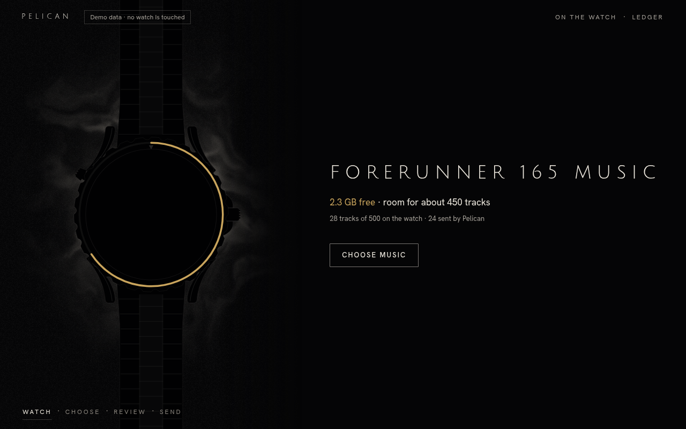
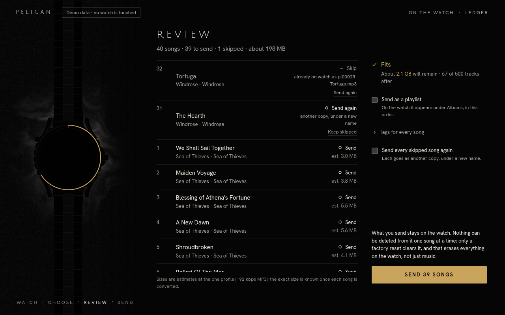
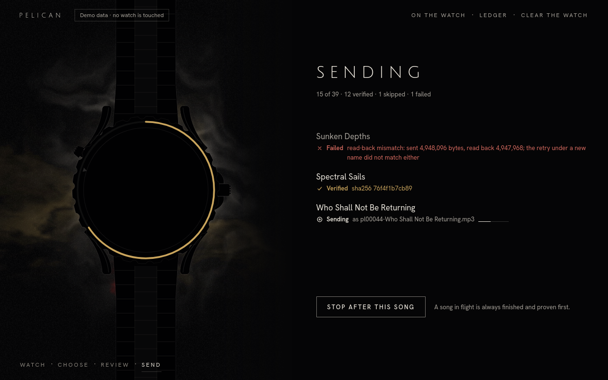
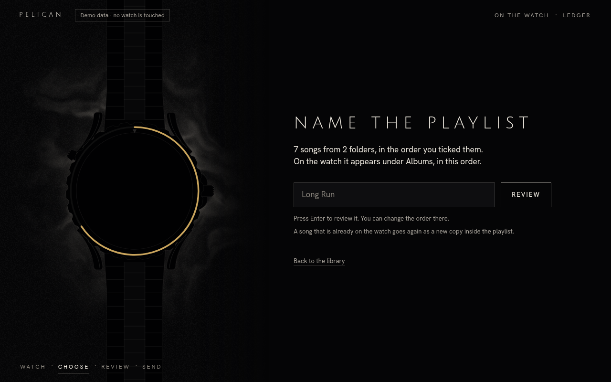
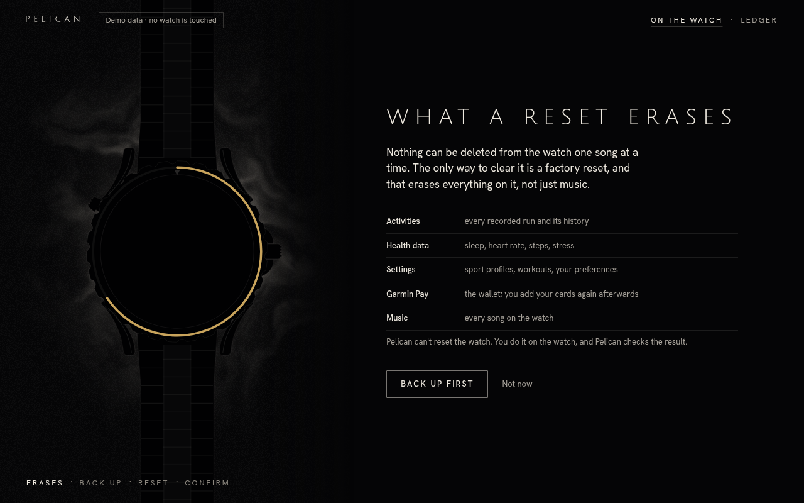

<h1 align="center">Krypteia · Pelican</h1>

<p align="center">
  <strong>Your music on your Garmin watch. No account, no cloud, no vendor app.</strong>
</p>

<p align="center">
  <a href="https://github.com/n0ble-s1x/pelican"></a>
  
  
  <a href="LICENSE-MIT"></a>
  
</p>

Pelican takes the music on your computer, converts it to a format Garmin
watches reliably play, sends it to the watch over USB, and proves every file
arrived intact. **No account, no daemon, no telemetry, and no network access.**

It exists because every path Garmin offers runs through a Garmin account.
Garmin Express is Windows and macOS only and wants you signed in; on Linux
there is no vendor tool at all, and the generic MTP tools lose or corrupt
files on these watches. Owning your music should not mean renting the cable.

A [Krypteia](https://github.com/n0ble-s1x) project.

---

## Why this exists

Krypteia is a privacy and security consulting practice. Our mission is to help people take back their digital sovereignty — to understand the systems they live inside, and to choose tools that don't make them the product.

This tool is part of that. We believe:

- **Privacy is a prerequisite for freedom.** What you listen to, when, and where — that's nobody's business but yours.
- **Own your data. Own your media.** Buy it once, keep it forever, no subscription tax, no licensing terms that change under you.
- **Open source is a public good.** Useful software should be inspectable, forkable, and improvable by anyone. We give back.
- **Linux deserves first-class tools.** Big Tech's desktop strategy treats Linux as "too small to bother with." We disagree.

If you're tired of streaming services telling you what you can listen to and watching them pull tracks out of "your" library — there's a way out. Buy your music DRM-free ([Qobuz](https://www.qobuz.com/) for hi-res FLAC, [Bandcamp](https://bandcamp.com/) for direct artist support, [7digital](https://www.7digital.com/) for catalogue) and put it on devices that play files, not licenses.

---

## Why a Garmin

We like Garmin watches because **you don't have to give them a phone.** Most modern fitness watches are useless without pairing to a smartphone running a vendor app that ingests your activity data, your heart rate, your sleep, your location — and uploads it to a cloud you don't control. Garmin watches still work standalone. Buy one, never sign into Garmin Connect, never install the phone app, and the watch still tracks your runs, paces you, and plays the music you put on it.

Combined with Pelican — which puts music on the watch over a USB cable, no account required — you have a complete loop: fitness data stays on the watch, your music stays on your computer, neither leaves unless you decide.

The **Tactix** and high-end **Forerunner** lines are excellent. The **Instinct** line is great if you want a rugged minimalist watch — though note that as of this writing **Instinct models don't have on-watch music**, so this tool won't help you there. Check the spec page before buying for music sync.

For the record: we're not affiliated with Garmin.

---

## What Pelican does

Pelican puts music on the watch, and proves it got there.

<p align="center">
  
</p>

It is a desktop app (and a command-line tool over the same core). A send is
four steps — **Watch → Choose → Review → Send**:

1. **Watch.** Plug the watch in. Pelican shows which watch it is, how much
   room is left, and how many tracks it holds of Garmin's 500.
2. **Choose.** Browse your music in a folder explorer — home, your music
   folder, network shares (a NAS) and removable drives are listed; tick whole
   folders or single songs. Or drop folders onto the window. No paths to type.
3. **Review.** Every track, the tags it will carry, its size, and whether it
   all fits — before anything touches the watch. Set artist, album, genre or
   year for the whole send if the files lack them.
4. **Send.** Each track is converted, sent, read back and checked. The list
   rolls up like credits as each one is proven, or says plainly why it failed.

<p align="center">
  
  
</p>

Under the hood, every send:

- **Transcodes to one proven profile.** FLAC, WAV, ALAC, AAC, MP3, OGG, Opus,
  AIFF, WMA — anything ffmpeg decodes becomes a CBR 192 kbps, 44.1 kHz stereo
  MP3 with an ID3v2.3 tag. No passthrough: one output format, one thing to get
  right.
- **Tags every track.** From the file's own tags, or from your folder layout
  (`Artist/Album/01 - Title.flac`) where there are none — untagged WAVs from a
  game soundtrack arrive named and grouped correctly.
- **Sends each file under a name the watch has never seen.** See
  [the one rule](#the-one-rule-never-reuse-a-name).
- **Reads every file back and hashes it.** A track counts as sent only when
  the bytes on the watch match the bytes Pelican made. A mismatch is retried
  once under a fresh name, and reported.
- **Checks space first**, and refuses a send that would overfill the watch or
  pass 500 tracks — before it writes anything.
- **Cleans up.** Converted files live in a per-send staging folder under
  `~/.cache/pelican/` and are gone when the send ends, however it ends. Your
  source files are only ever read.

### Playlists — sent as albums

The watch will not accept playlist files over USB (the Forerunner 165 rejects
every format, and each attempt leaves a broken, undeletable entry —
[`docs/playlists.md`](docs/playlists.md)). So Pelican sends a playlist **as an
album**: tick songs across any folders, give it a name, press Enter. On the
watch it appears under **Albums**, in your order — track numbers follow the
playlist, the album artist is "Various Artists", and each song keeps its own
title and artist. A song already on the watch goes again as a new copy inside
the playlist.

<p align="center">
  
</p>

### Send again

A track that is already on the watch is skipped by default. **Send again**
(per track in Review, or for the whole send) puts another copy on the watch
under a fresh name.

### When something goes wrong

Pelican says what happened and what to do, in plain words: the watch is not
plugged in, the file manager is holding it, this computer needs the USB rule
(one button installs it), or **the watch has stopped answering** — which
happens after a watch reboots, and is fixed by unplugging it, waiting five
seconds and plugging it back in.

Verified on a Forerunner 165 Music (firmware 2506) on Linux, 2026-09-26: a
24-track album sent in under a minute, every file hash-verified, confirmed
again by an independent libmtp read-back, and played on the watch. Details in
[`docs/status.md`](docs/status.md). Playlists-as-albums, the backup and the
start-over flow are built and tested against a simulated watch, and are next
in line for hardware verification.

---

## Nothing comes off the watch — read this before you fill it

**Once a track is on the watch, it stays in the watch's music library until
you factory-reset the watch — and a factory reset erases everything on the
watch, not just music.** Pelican has no delete, on purpose.

This is Garmin firmware behaviour, not a Pelican limitation, and it has been
reported for years across the Forerunner 245, 265, 645, 945 and 955 and the
fēnix 6 and 8:

- Deleting a file over USB removes the file and frees the space — but the
  watch's music library keeps listing the track. The entry survives replug
  and reboot, and no longer plays. We measured it: 22 files deleted, 78.5 MB
  freed, all 22 still listed.
- That library is not reachable over USB. No one has found the file behind it.
- Garmin Express does not reliably clear these entries either. Garmin's own
  manual points to Garmin Express or a full reset as the only ways to remove
  music.

A delete button that frees space but leaves a dead track in your library
would be a lie with a trash-can icon, so Pelican does not have one. Neither
the app, the command-line tool nor the library has any delete capability.

**So choose what you send.** The Review step shows exactly what will go
across, and with which tags, before anything touches the watch.

### Starting over

When you do want a clean watch, **On the watch → Start over** walks you
through it:

1. **What a reset erases** — activities, sleep and health data, settings,
   the Garmin Pay wallet, and music.
2. **Back up first.** One button copies the watch's own `GARMIN` folder
   (activities, monitoring, sleep, records, settings) to your Documents
   folder. It only reads from the watch. If you use Agoge or another fitness
   app, pull your activities into it too.
3. **Reset the watch** — on the Forerunner 165: hold **UP** → **System** →
   **Reset** → **Delete Data and Reset Settings**, then confirm. (Not *Reset
   Default Settings* — that keeps your music.)
4. **Confirm.** Plug the watch back in. Pelican checks for itself that no
   music is left before it starts a fresh ledger for the watch; if music
   remains, it tells you and changes nothing.

<p align="center">
  
</p>

Also not supported:

- **Real playlists** — see [Playlists — sent as albums](#playlists--sent-as-albums).
- **Folders inside `/Music`.** The firmware mishandles them; everything goes
  into `/Music` flat and the watch groups by tag.
- **Cover art.** It is stripped. Large embedded art makes the watch reject files.
- **macOS and Windows.** Linux only for now. The earlier macOS port is kept as
  a tag ([`docs/macos-port.md`](docs/macos-port.md)).

---

## The one rule: never reuse a name

Sending a file to a name that already exists on a Garmin music watch
corrupts **both** copies into broken objects that cannot be deleted, and that
name then fails for every future write — on Linux, macOS and Windows alike
([libmtp#307](https://github.com/libmtp/libmtp/issues/307); we hit it
independently). The watch also remembers names that no longer appear as files.

Pelican therefore never reuses a name. Every file goes out as
`pl00042-Title.mp3`, where the number comes from a per-watch **ledger** —
`~/.local/share/pelican/ledger-<serial>.jsonl`, an append-only log of every
name ever sent. A name is written to the ledger *before* the upload begins,
so even a crash mid-transfer burns it. Every name the watch currently
reports, including broken ones, is treated as taken too.

The ledger also means a track you already sent is skipped next time (Send
again, or `--resend`, overrides this under a new name). After a factory reset
and the Start over check, the ledger gains a `reset` line: older names no
longer count as taken, and the numbering keeps rising.

**Keep the ledger.** It is the only memory of which names are safe. It lives
in your data directory, not on the watch, so back it up with the rest of your
home folder. If you lose it, Pelican still refuses every name the watch can
report, but it can no longer see names the watch only remembers.

---

## Use

### The app

```sh
pelican-app
```

Plug in the watch and follow the four steps. The app keeps no settings
beyond the folder your library opens at.

### The command line

Everything the app does is also a command:

```sh
# What is plugged in, how full it is, how many names this machine has used
pelican status

# Preview: every file and the tags it will get. Converts nothing, touches no watch
pelican push --dry-run ~/Music/Master\ and\ Commander

# Send it
pelican push ~/Music/Master\ and\ Commander
#   verified  pl00031-Ghost of Time.mp3  ← …/02 - Ghost of Time.flac
#   …
#   14 verified, 0 skipped, 0 failed

# Set tags for a whole send (e.g. a soundtrack whose folder is the album)
pelican push --artist "Various Artists" --genre Soundtrack "/mnt/nas/Music/Sea of Thieves"

# A playlist, sent as an album, in the order given
pelican push --mix "Long Run" song1.flac other/song2.flac more/song3.wav

# What is in /Music: each entry marked ledger (sent by Pelican), foreign, or stub (broken)
pelican ls

# Every name this machine has sent to this watch
pelican ledger

# Before a factory reset: copy the watch's GARMIN folder (read-only on the watch)
pelican backup ~/Documents/watch-backup

# After a factory reset: checks /Music is empty, then starts a fresh ledger
pelican reset-ledger
```

`push` exits non-zero if any file failed. With more than one watch plugged
in, pick one with `--serial`.

---

## Compatibility

| Model | Firmware | Status |
|---|---|---|
| Forerunner 165 Music | 2506 | ✅ Verified end to end on Linux: transcode, send, hash read-back, plays |
| Other Garmin music watches (Forerunner 245/255/265/645/945/955/965 Music, Venu, fēnix, epix, tactix) | — | 🟡 Untested. Same MTP responder family, and the library and name-reuse behaviour above is reported on many of them |
| Watches without on-watch music | — | ❌ Not applicable |

**Want a model on the verified row?** Run the [test below](#verifying-a-new-watch)
and open an issue with the output.

---

## Install

Linux only, built from source for now:

```sh
# Needs: Rust 1.89+, ffmpeg, libudev, and for the app webkit2gtk-4.1
# (Arch: pacman -S --needed rustup ffmpeg webkit2gtk-4.1 base-devel)
git clone https://github.com/n0ble-s1x/pelican
cd pelican
cargo build --release -p pelican -p pelican-shell
sudo install -m 755 target/release/pelican target/release/pelican-app /usr/local/bin/
```

On a Wayland session with the NVIDIA driver, WebKitGTK can close at start
with `Error 71 (Protocol error)`. The app applies Tauri's documented
workaround (`__NV_DISABLE_EXPLICIT_SYNC=1`) for itself, only in that
combination, and never over a value you have set.

### One-time USB permission (required)

The watch needs a udev rule so your user can talk to it without root.
The AUR package (and the `.deb`) install the rule themselves, to
`/usr/lib/udev/rules.d/`; nothing to do. From a source build, the window
offers an **Install the USB rule** button when the watch cannot be opened:
it asks for your password once through polkit, writes this one file to
`/etc/udev/rules.d/` and reloads udev, and shows exactly what it runs
before you press it. (Inside a Flatpak it cannot, and shows the command
instead.) Or do it by hand:

```sh
sudo install -m 644 udev/70-garmin-mtp.rules /etc/udev/rules.d/
sudo udevadm control --reload
sudo udevadm trigger --action=add --subsystem-match=usb --attr-match=idVendor=091e
```

It has to be numbered below 73. systemd grants device access in
`73-seat-late.rules`, and a rule sorted after that (older Pelican shipped a
`99-` rule) is silently ignored. The rule also deliberately does not mark the
watch as an MTP device for your desktop. The watch allows one connection at a
time, and a file manager that auto-mounts it will block Pelican. If
the app or `pelican status` warns that the file manager is holding the
watch, close it or eject the watch from its side bar.

### Packages

An AUR `PKGBUILD` ([`packaging/aur/`](packaging/aur/)) and a Debian package
config (`cargo deb -p pelican`) are in the tree for the command-line tool;
neither is published yet, and neither packages the app yet. A Flatpak is
planned — see [Roadmap](#roadmap).

---

## Verifying a new watch

```sh
pelican status                       # does it see the watch?
pelican push --dry-run ONE_ALBUM     # are the tags right?
pelican push ONE_ALBUM               # every line should say "verified"
pelican ls                           # new rows marked "ledger", no new "stub"
```

Then unplug the watch and play a few tracks. Report the model, firmware and
results in an issue.

---

## How it works

A Rust workspace with three crates:

- **`pelican-core`**: the library. Source walk and tag resolution, ffmpeg,
  the ledger and staging folder, the watch backup, and the MTP transfer. The
  transfer uses [`mtp-rs`](https://crates.io/crates/mtp-rs) and
  [`nusb`](https://crates.io/crates/nusb), pure Rust with no libmtp and no
  FFI: one session per send, split-header/data transfers (Garmin's firmware
  hangs without them), streamed uploads, and a read-back hash per file. The
  device interface has no delete method.
- **`pelican-shell`**: the app, a [Tauri 2](https://tauri.app/) window over
  the core. The interface in `ui/` is plain HTML, CSS and JavaScript — no
  npm, no framework, no bundler — with its fonts shipped inside it. It can
  call only the commands the interface uses, under a strict content policy
  with no network origins.
- **`pelican`**: the command-line tool.

No daemon, no telemetry, no network access at runtime. `unsafe` is denied
workspace-wide, with one documented exception for the gvfs ownership check.

The protocol notes behind all of this, including what the watch answers,
what wedges it and what we tried that failed, are in [`docs/`](docs/):

| Doc | What's in it |
|---|---|
| [`status.md`](docs/status.md) | What the current build does, and what was verified on hardware |
| [`garmin-library-persistence.md`](docs/garmin-library-persistence.md) | The ghost-library problem, community evidence, and the experiments that settled it |
| [`garmin-mtp.md`](docs/garmin-mtp.md) | Full MTP protocol reference for Garmin music watches |
| [`rebuild-plan.md`](docs/rebuild-plan.md) | The requirements the current build is held to |
| [`playlists.md`](docs/playlists.md) | Why playlist writes fail on the FR165 |

---

## Roadmap

- **Hardware verification** of playlists-as-albums, the backup and the
  start-over flow on a real watch.
- **Flatpak and AUR packages** for the app, so it installs on any
  distribution.
- **More verified watches.** This needs owners willing to run the test above.

Not on the roadmap: delete, real playlists, or anything else the watch
firmware has not been shown to support.

---

## Privacy / security

- Zero telemetry, zero network access at runtime.
- Everything Pelican keeps is in `~/.local/share/pelican/` (the ledger),
  `~/.config/pelican/` (the folder your library opens at) and
  `~/.cache/pelican/` (transient staging). A backup goes where you choose,
  by default under `~/Documents/Pelican/`. Nothing leaves the machine.
- Dependencies are checked with `cargo deny` and `cargo audit`.
- Vulnerability reports → [`SECURITY.md`](SECURITY.md).

---

## Contributing

Read [`CONTRIBUTING.md`](CONTRIBUTING.md). PRs welcome, and hardware reports
from other watch models most of all.

---

## License

Dual-licensed under [MIT](LICENSE-MIT) and [Apache 2.0](LICENSE-APACHE) at your option.

---

## Acknowledgements

- [`mtp-rs`](https://crates.io/crates/mtp-rs) and [`nusb`](https://crates.io/crates/nusb) — pure-Rust MTP/USB stack we stand on.
- [`better-sync`](https://github.com/Schachte/better-sync) (Schachte) — Go reference implementation that informed our playlist-format research.
- [`go-mtpfs`](https://github.com/ganeshrvel/go-mtpfs) — the upstream PR documenting Garmin's split-header / short-data-phase USB quirks.
- [`libmtp`](https://github.com/libmtp/libmtp) — device-table research and `DEVICE_FLAGS_ANDROID_BUGS` lineage that explained the firmware family.
- Pattern inspiration from [Pop!_OS COSMIC Files](https://github.com/pop-os/cosmic-files) (GPL-3.0 — pattern only, no code borrowed).
- Everyone who keeps fighting for the open web. Keep going.

— *Krypteia, 2026*
